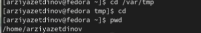
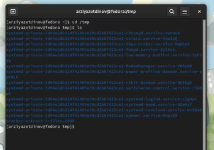
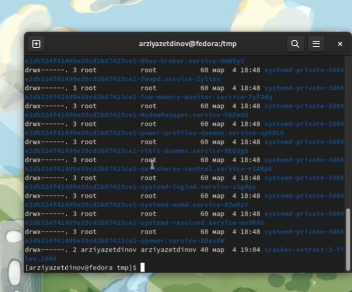
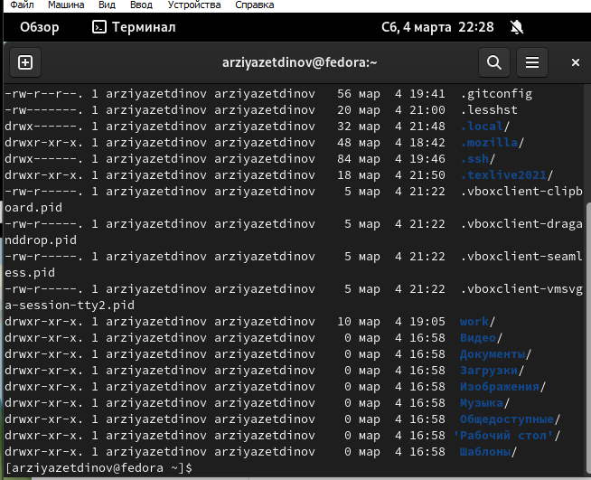
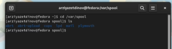
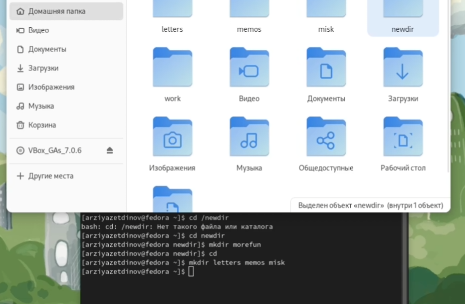
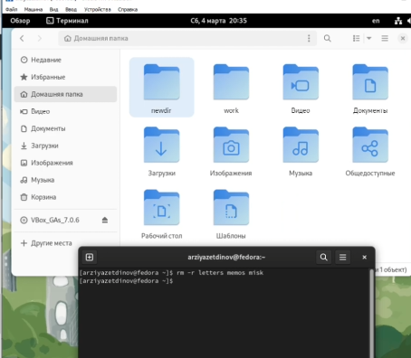
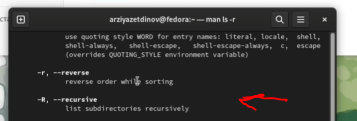

---
## Front matter
title: "Отчёт по лабораторной работе №4"
subtitle: "дисциплина: Операционные системы"
author: "Студент: Зиязетдинов Алмаз Радикович"

## Generic otions
lang: ru-RU
toc-title: "Содержание"

## Bibliography
bibliography: bib/cite.bib
csl: pandoc/csl/gost-r-7-0-5-2008-numeric.csl

## Pdf output format
toc: true # Table of contents
toc-depth: 2
lof: true # List of figures
lot: true # List of tables
fontsize: 12pt
linestretch: 1.5
papersize: a4
documentclass: scrreprt
## I18n polyglossia
polyglossia-lang:
  name: russian
  options:
	- spelling=modern
	- babelshorthands=true
polyglossia-otherlangs:
  name: english
## I18n babel
babel-lang: russian
babel-otherlangs: english
## Fonts
mainfont: PT Serif
romanfont: PT Serif
sansfont: PT Sans
monofont: PT Mono
mainfontoptions: Ligatures=TeX
romanfontoptions: Ligatures=TeX
sansfontoptions: Ligatures=TeX,Scale=MatchLowercase
monofontoptions: Scale=MatchLowercase,Scale=0.9
## Biblatex
biblatex: true
biblio-style: "gost-numeric"
biblatexoptions:
  - parentracker=true
  - backend=biber
  - hyperref=auto
  - language=auto
  - autolang=other*
  - citestyle=gost-numeric
## Pandoc-crossref LaTeX customization
figureTitle: "Рис."
tableTitle: "Таблица"
listingTitle: "Листинг"
lofTitle: "Список иллюстраций"
lotTitle: "Список таблиц"
lolTitle: "Листинги"
## Misc options
indent: true
header-includes:
  - \usepackage{indentfirst}
  - \usepackage{float} # keep figures where there are in the text
  - \floatplacement{figure}{H} # keep figures where there are in the text
---

# Цель работы

Приобретение практических навыков взаимодействия пользователя с
системой посредством командной строки.

# Задание

1
Определите полное имя вашего домашнего каталога. Далее
относительно этого каталога будут выполняться последующие
упражнения.
2
Выполните следующие действия:
•
Перейдите в каталог /tmp.
•
Выведите на экран содержимое каталога /tmp. Для этого
используйте команду ls с различными опциями. Поясните разницу в
выводимой на экран информации.
•
Определите, есть ли в каталоге /var/spool подкаталог с именем cron?
•
Перейдите в Ваш домашний каталог и выведите на экран его
содержимое. Определите, кто является владельцем файлов и
подкаталогов?
3
Выполните следующие действия:
•
В домашнем каталоге создайте новый каталог с именем newdir.
•
В каталоге ~/newdir создайте новый каталог с именем morefun.
•
В домашнем каталоге создайте одной командой три новых каталога
с именами letters, memos, misk. Затем удалите эти каталоги одной
командой.
•
Попробуйте удалить ранее созданный каталог ~/newdir командой rm.
Проверьте, был ли каталог удалён.
•
Удалите каталог ~/newdir/morefun из домашнего каталога.
Проверьте, был ли каталог удалён.
4
С помощью команды man определите, какую опцию команды ls
нужно использовать для просмотра содержимое не только
указанного каталога, но и подкаталогов, входящих в него.
5
С помощью команды man определите набор опций команды ls,
позволяющий отсортировать по времени последнего изменения
выводимый список содержимого каталога с развёрнутым
описанием файлов.
6
Используйте команду man для просмотра описания следующих
команд: cd, pwd, mkdir, rmdir, rm. Поясните основные опции этих
команд.
7
Используя информацию, полученную при помощи команды history,
выполните модификацию и исполнение нескольких команд из
буфера команд.
                                                                                |

# Выполнение лабораторной работы

Полное имя домашнего каталога с помощью команды pwd
(рис. @fig:001).
{ #fig:001 width=70% height=70% }

Следующим шагом перейдём в каталог /tmp с помощью команды cd (рис. @fig:001).
{#fig:002 width=70%}

Вывожу на экран содержимое каталога /tmp. Для этого используйте команду ls
с различными опциями

ls 

{#fig:003 width=70%}

{#fig:004 width=70%}
  
{#fig:005 width=70%} 
{#fig:006 width=70%} 
{#fig:007 width=70%}

Определяем, есть ли в каталоге /var/spool подкаталог с именем cron. 

Перехожу в домашний каталог и с помощью команд сd и ls проверим
это  
{#fig:008 width=70%}

 подкаталога с именем cron НЕТ
 
Далее переходим в наш домашний каталог с помощью команды cd и
выводим его содержимое 
{#fig:009 width=70%}

Содержимое домашнего каталога

В домашнем каталоге создаю новый каталог с именем newdir с помощью
команды mkdir и проверяем выполнение данной команды 

{#fig:010 width=70%}

В каталоге newdir создаём новый каталог с именем morefun 

{#fig:012 width=70%}

Одной командой создаём три новых каталога с именами letters, memos, misk.
Затем одной командой rmdir удаляем их 
{#fig:013 width=70%}

{#fig:014 width=70%}

Попытка удаления каталога newdir 
Удаляем каталог newdir и подкаталог morefun из домашнего каталога,
после чего выполняем проверку командой ls. 
{#fig:015 width=70%}

С помощью команды man ls выясняем, что для просмотра содержимого не
только указанного каталога, но и подкаталогов нужно использовать
опцию -R 
{#fig:016 width=70%}

Поиск нужной опции
Используем команду man для просмотра описания команд: cd, pwd, mkdir,
rmdir, rm.
Команда cd используется для перемещения по файловой системе
операционной системы типа Linux 
{#fig:017 width=70%}

Для определения абсолютного пути к текущему каталогу используется
команда pwd (print working directory) 
{#fig:018 width=70%}

Команда mkdir используется для создания каталогов 
{#fig:019 width=70%}

Команда rmdir используется для удаления пустых каталогов 
{#fig:020 width=70%}

# Выводы

В ходе выполнения лабораторной работы были приобретены
практические навыки взаимодействия пользователя с системой
посредством командной строки.

# Контрольные вопросы
1
Что такое командная строка? Терминал Linux предоставляет
интерфейс, в котором можно вводить команды и видеть результат,
напечатанный в виде текста. Можно использовать терминал для
выполнения таких задач, как перемещение файлов или навигация
по каталогу, без использования графического интерфейса.
2
При помощи какой команды можно определить абсолютный путь
текущего каталога? Приведите пример. При помощи команды pwd.
3
При помощи какой команды и каких опций можно определить
только тип файлов и их имена в текущем каталоге? Приведите
примеры. ls -F.
4
Каким образом отобразить информацию о скрытых файлах?
Приведите примеры. Для того, чтобы отобразить имена скрытых
файлов, необходимо использовать команду ls с опцией a.
5
При помощи каких команд можно удалить файл и каталог? Можно
ли это сделать одной и той же командой? Приведите примеры. rmdir
и rm.
6
Каким образом можно вывести информацию о последних
выполненных пользователем командах? работы?
7
Как воспользоваться историей команд для их модифицированного
выполнения? Приведите примеры. С помощью команды history.
8
Приведите примеры запуска нескольких команд в одной строке.
9
Дайте определение и приведите примера символов экранирования.
Экранирование символов — замена в тексте управляющих символов
на соответствующие текстовые подстановки.
10 Охарактеризуйте вывод информации на экран после выполнения
команды ls с опцией l. Чтобы вывести на экран подробную
информацию о файлах и каталогах, необходимо использовать опцию
l. При этом о каждом файле и каталоге будет выведена следующая
информация: тип файла, право доступа, число ссылок, владелец,
размер, дата последней ревизии, имя файла или каталога.
11 Что такое относительный путь к файлу? Приведите примеры
использования относительного и абсолютного пути при
выполнении какой-либо команды. Относительный путь
представляет собой путь по отношению к текущему рабочему
каталогу пользователя или активных приложений.
12 Как получить информацию об интересующей вас команде? При
помощи команды man.
13 Какая клавиша или комбинация клавиш служит для
автоматического дополнения вводимых команд? Tab.
