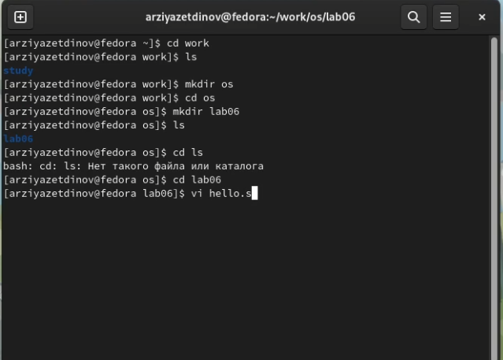
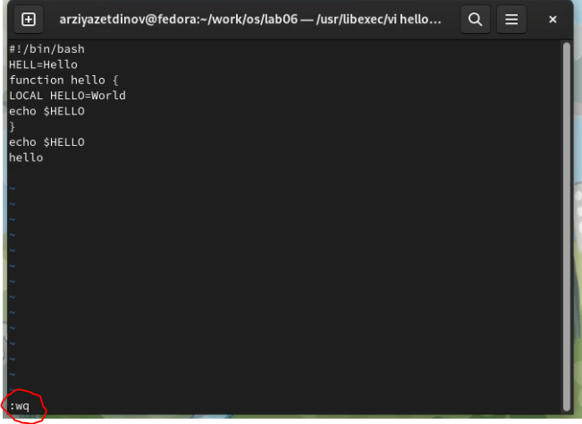
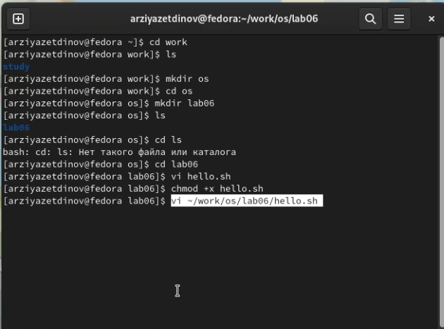
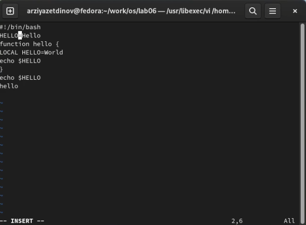
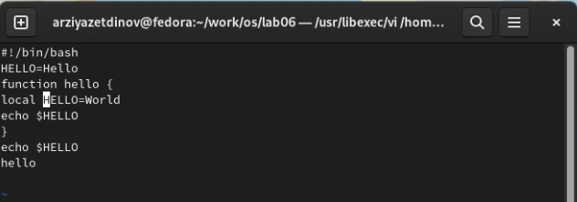
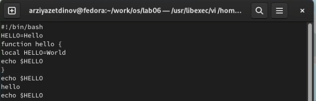
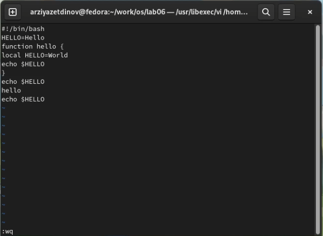

---
## Front matter
lang: ru-RU
title: Лабораторная работа № 8.
author: |
	Зиязетдинов Алмаз Радикович
institute: |
	RUDN, Москва, Россия

## Formatting
toc: false
slide_level: 2
theme: metropolis
header-includes: 
 - \metroset{progressbar=frametitle,sectionpage=progressbar,numbering=fraction}
 - '\makeatletter'
 - '\beamer@ignorenonframefalse'
 - '\makeatother'
aspectratio: 43
section-titles: true
---

# Текстовой редактор vi

## Создание новых каталогов и вызов vi

vi hello.sh (команда для вызова и создания файла).

{ #fig:001 width=100% }

## Работа в vi

"i" - добавление или изменение текста. 

{ #fig:002 width=100% }

## Работа в vi

"Esc" - для перехода в командный режим.

":" - для перехода в режим последней строки.

"w" (запись) и "q" (выйти). 

"Enter" - для сохранения.

{ #fig:003 width=70% }

## Исполняемый файл и его вызов на редактирование

{ #fig:004 width=100% }

## Замена слова

{ #fig:005 width=100% }

## Удаление слова и добавление нового

{ #fig:006 width=100% }

## Добавление новой строки

{ #fig:007 width=100% }

## Удаление всей строки

"d" - двойное нажатие для удаления всей строки.
	
{ #fig:008 width=100% }

## Отмена последней команды

"u" - для отмены последней команды. 

{ #fig:009 width=100% }

# Выводы

В ходе выполнения лабораторной работы мы познакомились с операционной системой Linux и получили практические навыки работы с редактором vi, установленным по умолчанию практически во всех дистрибутивах.

## {.standout}

Спасибо за внимание!
